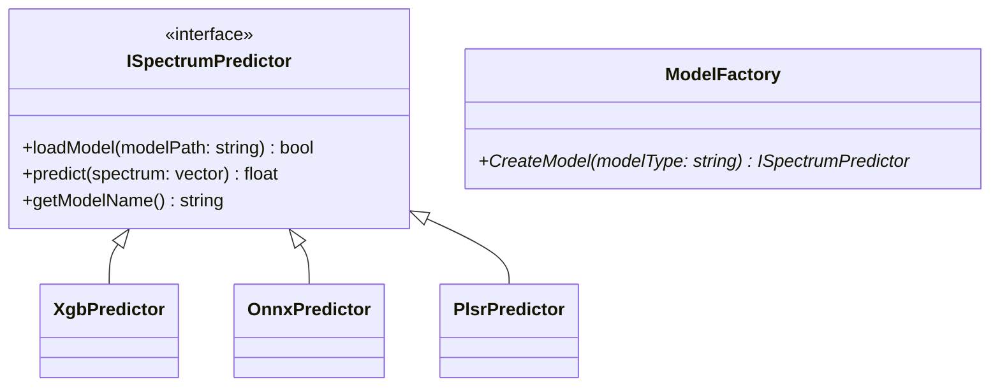

这是一份为你量身定制的、符合工业界标准规范的 **C++ 推理引擎开发者文档**。你可以将其保存为 `README.md` 或放到项目的 `docs/` 目录下。

---

# SpectraBrix Engine (西瓜多光谱糖度推理引擎) 开发者文档

## 1. 项目概述

**SpectraBrix Engine** 是一个基于 C++ 开发的高效、轻量级动态链接库（DLL / SO）。该模块专为“西瓜光谱特征到糖度（Brix）预测”的边缘计算场景设计。
项目采用“Python离线训练，C++在线推理”的 MLOps 分离架构。底层对接 AMS AS7341 传感器（11通道多光谱），上层可供 C#, Python, UI 界面等宿主程序调用。

### 1.1 核心特性
* **多态架构**：采用工厂模式设计，支持 8 种传统机器学习与深度学习模型动态热切换。
* **品种自适应**：支持业务层传入西瓜品种（如 `qilin`, `8424`），动态加载对应品种的最佳模型权重。
* **低耦合性**：深度学习模型统一使用 ONNX Runtime 部署，彻底屏蔽矩阵运算底层细节。

---

## 2. 依赖与编译环境

* **C++ 标准**: C++ 17 及以上
* **构建工具**: CMake 3.15+
* **第三方核心库**:
  * **ONNX Runtime (ORT)**: (用于 MLP, 1D-CNN, Transformer 推理)
  * **XGBoost C API**: (用于 XGBoost 决策树推理)
  * **Eigen 3** (可选): (若独立实现 PLSR 矩阵运算)

---

## 3. 目录与资产规范

项目由 **C++ 源码区** 和 **模型资产区** 组成。

### 3.1 代码目录结构
```text
SpectraBrixEngine/
├── CMakeLists.txt
├── include/
│   ├── ISpectrumPredictor.h    # 核心抽象基类
│   ├── ModelFactory.h          # 模型工厂
│   └── ExportAPI.h             # 对外暴露的 C-API 接口
├── src/
│   ├── models/                 # 各模型具体派生类实现
│   │   ├── XgbPredictor.cpp
│   │   ├── OnnxPredictor.cpp   # 统一处理 CNN/MLP/Transformer
│   │   └── PlsrPredictor.cpp
│   ├── ModelFactory.cpp
│   └── ExportAPI.cpp           # 库函数导出实现
└── model_assets/               # 【关键】模型权重资产库
    ├── qilin/                  # 品种：麒麟瓜
    │   ├── xgboost.json        
    │   ├── mlp.onnx            
    │   └── transformer.onnx    
    └── 8424/                   # 品种：8424 (仅部署最优模型)
        └── xgboost.json        
```

### 3.2 模型权重命名规范
权重文件需放置在 `./model_assets/<品种名>/` 目录下，命名规则为 `<模型类型>.[json|onnx]`。模块内部会根据此规则自动拼接路径。

---

## 4. 核心架构设计

系统基于面向对象（OOP）的多态机制实现，核心类图关系如下：


*注：无论是 MLP、1D-CNN 还是 Transformer，在部署阶段均可合并为 `OnnxPredictor` 类统一处理，极大地减少了 C++ 端代码量。*

---

## 5. C-API 接口参考 (宿主程序调用指南)

编译输出的动态库 (`SpectraBrix.dll` 或 `libSpectraBrix.so`) 暴露了标准 C 接口，以确保被 C#、Python 或其他语言无缝调用。

### `InitPredictor`
**功能**：初始化预测器引擎，分配内存并加载对应品种与模型的权重文件。
**签名**：
```c
// extern "C"
bool InitPredictor(const char* variety, const char* model_type);
```
* **参数**：
  * `variety`：西瓜品种的拼音或代号，如 `"qilin"`。
  * `model_type`：要实例化的模型类型，当前支持：`"plsr"`, `"xgboost"`, `"mlp"`, `"cnn"`, `"transformer"`。
* **返回**：`true` 成功，`false` 失败（通常因权重文件不存在）。

### `PredictBrix`
**功能**：输入 AS7341 的 11 通道光谱数据，执行前向推理，返回糖度。
**签名**：
```c
// extern "C"
float PredictBrix(const float* spectrum_11_channels);
```
* **参数**：长度严格为 11 的 `float` 数组指针。
* **返回**：预测的折光糖度值（如 `11.5`）。若未初始化模型，返回 `-1.0`。

### `ReleasePredictor`
**功能**：释放模型占用的系统内存/显存（退出程序前必须调用）。
**签名**：
```c
// extern "C"
void ReleasePredictor();
```

---

## 6. MLOps 开发与实验工作流

为了寻找到不同品种的最佳糖度预测算法，算法/研发人员需遵循以下工作流：

1. **第一阶段：海选实验（以麒麟瓜为靶标）**
   * 在 Python 环境下，使用收集到的 麒麟瓜 数据（11通道数据+实际糖度标签）。
   * 训练全部 8 种模型（XGBoost, MLP, CNN, Transformer 等）。
   * 将所有模型导出至 `model_assets/qilin/` 目录。
   * 上层业务通过切换 `model_type` 参数，在实机环境中进行 A/B 测试。

2. **第二阶段：架构定型与横向扩展**
   * 若实验证明 `xgboost` 表现最稳定、泛化最好。
   * 后续新增品种（如 8424、黑美人），**在 Python 端只训练 XGBoost 模型**。
   * 将新模型的权重放入 `model_assets/8424/xgboost.json`。
   * C++ 推理引擎代码 **零修改**，只需业务层传入参数 `InitPredictor("8424", "xgboost")` 即可。

---

## 7. 二次开发指南：如何添加新模型

如果你需要在 C++ 中硬编码增加一种未涵盖的特殊模型类别：

1. 在 `src/models/` 创建新类（如 `CustomPredictor.h / .cpp`）。
2. 继承 `ISpectrumPredictor` 接口：
   ```cpp
   class CustomPredictor : public ISpectrumPredictor {
   public:
       bool loadModel(const std::string& modelPath) override { /* 你的加载逻辑 */ }
       float predict(const std::vector<float>& spec) override { /* 你的推理逻辑 */ }
       std::string getModelName() const override { return "custom_model"; }
   };
   ```
3. 在 `ModelFactory::CreateModel` 方法中增加条件分支：
   ```cpp
   if (modelType == "custom") {
       return new CustomPredictor();
   }
   ```
4. 重新编译动态库。

---

## 8. 注意事项与 FAQ

1. **输入数据预处理一致性**：C++ 端不做复杂的归一化处理。如果在 Python 训练前对 11 通道光谱进行了 `StandardScaler` (Z-score 归一化) 或除以最大曝光值等处理，**请务必确保 C++ 宿主程序在调用 `PredictBrix` 前，执行了完全相同的数学预处理**。
2. **ONNX Runtime 注意事项**：由于 AS7341 数据仅 11 个特征，ONNX 推荐使用 **CPU Provider**。引入 GPU (CUDA) 反而会因为 CPU-GPU 显存间的数据拷贝延迟导致整体推理变慢。
3. **线程安全性**：当前的 `ISpectrumPredictor` 实例不是线程安全的。在多线程工业流水线上，同一时刻请勿让多个线程并发调用同一模型的 `PredictBrix` 接口。如果需要多线程测算多个西瓜，请为每个线程实例化一个对象池。